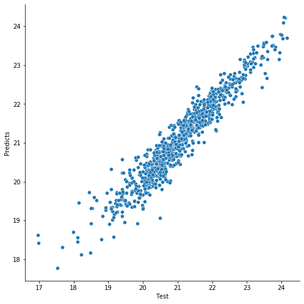

## Data
Ames Housing Dataset [paper](http://jse.amstat.org/v19n3/decock/AmesHousing.txt)


## Prerequisites

To set up your development environment use:
```
pip install -r requirements.txt
```

## Mylib

[Documentation](https://se_ml_course.gitlab.io/2021/sotnikov.ad)

To install mylib package use:
```
python setup.py install
```

To test mylib package use:
```
make tests
```


## Docker

Download latest image [here](https://gitlab.com/se_ml_course/2021/sotnikov.ad/container_registry/1842906)

Structure:
```
|__ myflask
    |__ app
        |__ templates
            |__ index.html
        |__ __init__.py
        |__ routes.py
    |__ myflask.py
|__ Dockerfile
|__ requirements.txt
```

To interact with train and test processes you can connect to ```localhost:5000```.

## Commands

#### train.py

Script for training a model based on sklearn 'train' command.

| Argument      | Required | Description                                      |
|:--------------|:---------|--------------------------------------------------|
| --data_path   | true     | path to input file with data                     |
| --log_path    | true     | path to the folder with logs                     |
| --model_path  | true     | path to folder with trained models               |


#### predict.py

Script for model evaluation. The test dataset should have the same format as the train dataset.

| Argument       | Required | Description                                      |
|:---------------|:---------|--------------------------------------------------|
| --data_path    | true     | path to input file with data                     |
| --log_path     | true     | path to the folder with logs                     |
| --model_path   | true     | path to folder with trained models               |
| --results_path | true     | path to folder with predictions                  |


## EDA & Cleansing

The entire process of analyzing and cleaning data is described in this notebook: [Cleansing&EDA.ipynb](https://gitlab.com/se_ml_course/2021/sotnikov.ad/-/blob/develop/notebooks/Cleansing&EDA.ipynb)


## Results



R<sup>2</sup> on test dataset: 0.918

MSE on test dataset (with box-cox transformation): 0.014

